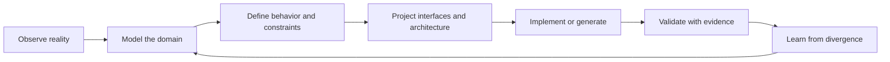

# Vision and Charter

## Product statement

Project Builder is a studio for converting an intended outcome into a precise, inspectable system model. It guides a person from domain discovery through actors, episodes, scenarios, scenes, interactions, state, rules, paths, interfaces, boundaries, architecture, validation, and implementation. The result is not a collection of disconnected diagrams. It is one canonical model with many coordinated views.

The product exists because most software projects begin with fragments. Requirements live in prose, workflows in a whiteboard, interface ideas in design files, architecture in slide decks, acceptance criteria in tickets, tests in code, and operational truths in the memories of a few people. Each artifact is locally useful, but the project has no durable mechanism for proving that they describe the same system.

Project Builder makes that relationship explicit. A control on a screen is connected to an actor intent. The intent is connected to an application use case. The use case invokes domain behavior. The behavior changes named state under named rules. External effects cross explicit boundaries through explicit contracts. Expected and exceptional outcomes become behavioral claims. Claims are connected to evidence.

## North star

A project is sufficiently defined when another competent person can explain what the system must do, why it must do it, what may vary, what must never vary, how failure is handled, and what evidence would prove the implementation correct.

The product cannot guarantee that a model is true. It can make unsupported certainty difficult, expose contradictions, preserve assumptions, and show which claims still lack evidence.

## The product loop

The loop is recursive. A high-level episode can be opened to reveal a scenario. A scenario can be opened to reveal scenes and interactions. An interaction can be opened to reveal application orchestration, domain transitions, and infrastructure boundaries. A generated implementation can be reopened as evidence or as a source of newly discovered constraints.

## Product promises

Project Builder promises to:

1. Preserve one authoritative semantic model while allowing many useful visual and textual projections.
2. Keep domain state separate from presentation and canvas state.
3. Treat unknowns, assumptions, contradictions, and gaps as first-class information.
4. Allow the full workflow to be completed by a human without an agent.
5. Use guidance to teach modeling rather than merely demand fields.
6. Let authors begin at a level appropriate to their understanding, then drill deeper without discarding earlier work.
7. Capture happy, alternate, exceptional, degraded, and recovery behavior.
8. Connect every implementation claim to a definition and every validated definition to evidence.
9. Generate inspectable artifacts rather than opaque runtime magic.
10. Dogfood the product by modeling Project Builder in Project Builder.

## Primary problem

The primary problem is not that teams lack diagramming software. It is that their diagrams, requirements, interfaces, architecture, and tests do not share identity or semantics. A box named "Payment Service" in one diagram has no durable connection to an API contract, a retry rule, a threat, a test, or a user-visible failure state elsewhere.

Project Builder therefore begins as a semantic modeling system with visual editors, not as a generic infinite canvas.

## Long-term destination

The long-term destination resembles a modern visual programming environment:

- The author models an outcome and the behaviors required to produce it.
- Project Builder derives candidate interfaces, contracts, states, tests, and implementation slices.
- The author chooses architecture after the relevant boundaries and qualities are known.
- Code generation produces explicit, idiomatic C# scaffolding and specifications.
- The model can drive simulations, test harnesses, documentation, and selected runtime behaviors.
- Handwritten code and generated artifacts report evidence back to the model.
- The system can explain which definitions are implemented, contradicted, untested, or stale.

This is not "draw boxes and receive an application." It is "define the application well enough that implementation becomes a constrained, reviewable projection."

## Charter boundaries

Project Builder is responsible for:

- domain and process discovery,
- model organization,
- interface and interaction design,
- state and rule definition,
- architecture and boundary mapping,
- validation planning,
- traceability,
- projection and generation,
- collaborative review,
- model versioning and interchange.

It is not initially responsible for:

- replacing a production IDE,
- compiling every model into a complete application,
- serving as a general-purpose drawing tool,
- managing all project work,
- inventing business truth,
- replacing domain experts,
- replacing specialist design, database, security, or operations tools.

## Intended users

The product should be approachable to a founder describing a new product, a clerk explaining a point-of-sale workflow, an analyst capturing organizational behavior, a designer mapping interactions, an architect mapping systems, an engineer shaping a vertical slice, and a validator deciding what proof is required.

The system can use role-specific language and lenses, but all roles operate on the same underlying model.
