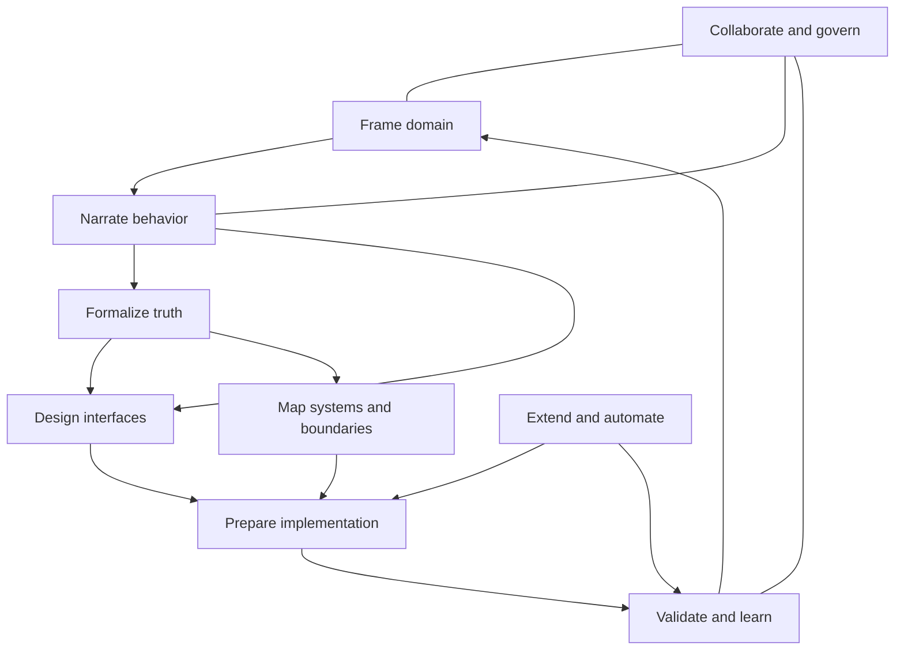

# Capability Map

## Capability layers

Project Builder capabilities are grouped by the value they provide rather than by technical component. The roadmap may implement parts of several layers in one vertical slice.

## 1. Frame the domain

### 1.1 Project intent
Capture purpose, target outcomes, beneficiaries, scope, constraints, and source authority.

### 1.2 Context mapping
Define contexts, terms, responsibilities, ownership, and relationships.

### 1.3 Actor discovery
Identify roles, participants, authority, incentives, knowledge, and constraints.

### 1.4 Capability discovery
Describe stable abilities independent of a chosen process or system design.

## 2. Narrate behavior

### 2.1 Episode mapping
Describe end-to-end outcomes in participant language.

### 2.2 Scenario modeling
Define concrete paths under explicit starting conditions.

### 2.3 Scene decomposition
Segment scenarios by setting, responsibility, interface, or boundary.

### 2.4 Interaction modeling
Capture initiator, intent, receiver, observation, and consequence.

### 2.5 Path expansion
Model happy, alternate, exceptional, degraded, and recovery behavior.

## 3. Formalize truth

### 3.1 Concept and state modeling
Define facts, state categories, entities, values, and derived information.

### 3.2 Rule and invariant modeling
Express constraints, calculations, decisions, and properties.

### 3.3 Event and transition modeling
Connect commands, events, state transitions, outcomes, and effects.

### 3.4 Temporal modeling
Represent deadlines, windows, ordering, timeouts, recurrence, and staleness.

### 3.5 Authority and policy
Identify who or what is permitted to decide, perform, or override behavior.

## 4. Design interfaces

### 4.1 Interface classification
Choose graphical, CLI, API, message, MCP, device, document, or human procedure surfaces.

### 4.2 State exposure
Select what domain or application information becomes observable.

### 4.3 Intent binding
Map controls, commands, calls, signals, or steps to modeled intents.

### 4.4 Feedback and errors
Design validation, progress, success, denial, degradation, and recovery representations.

### 4.5 Interaction simulation
Walk scenarios through interface states and verify continuity.

### 4.6 Accessibility and operability
Model keyboard, focus, assistive technology, environmental, and device constraints.

## 5. Map systems and boundaries

### 5.1 System context
Identify internal and external systems, people, devices, and providers.

### 5.2 Boundary classification
Describe ownership, trust, transaction, process, deployment, protocol, and residency boundaries.

### 5.3 Contract modeling
Define inputs, outputs, errors, timing, compatibility, security, and semantics.

### 5.4 Data flow
Trace data origin, transformation, storage, movement, retention, and visibility.

### 5.5 Quality attributes
Model performance, availability, reliability, recoverability, security, privacy, and operability scenarios.

### 5.6 Decision records
Capture alternatives, rationale, evidence, consequences, and supersession.

## 6. Prepare implementation

### 6.1 Vertical-slice projection
Assemble the relevant interface, application, domain, infrastructure, and evidence content for one behavior.

### 6.2 Architecture projection
Map model elements to modules, components, ports, adapters, stores, and deployment units.

### 6.3 Specification generation
Produce behavioral specs, state tables, contract manifests, and acceptance criteria.

### 6.4 Code scaffolding
Generate explicit solution structures, types, handlers, ports, adapters, test shells, and identifiers.

### 6.5 Work packaging
Create bounded work packets with fixed decisions, open questions, dependencies, and completion proof.

## 7. Validate and learn

### 7.1 Model validation
Find structural, semantic, contradiction, coverage, and authority issues.

### 7.2 Evidence planning
Select proportionate proof for each claim.

### 7.3 Evidence ingestion
Attach CI results, test reports, reviews, experiments, and operational observations.

### 7.4 Traceability
Follow outcome to behavior to state to implementation to evidence, and back.

### 7.5 Divergence management
Record where reality, model, implementation, or evidence disagree.

### 7.6 Impact analysis
Identify affected claims, views, contracts, tests, and releases after change.

## 8. Collaborate and govern

### 8.1 Change sets and history
Commit atomic edits with reason and authorship.

### 8.2 Review and approval
Comment, request changes, approve by authority, and establish baselines.

### 8.3 Presence and concurrency
Support safe concurrent work, awareness, and conflict handling.

### 8.4 Templates and profiles
Govern reusable starting structures and validation expectations.

### 8.5 Identity and access
Manage workspace, project, claim-category, and integration permissions.

### 8.6 Export, retention, and audit
Preserve portability, lifecycle policy, and accountable history.

## 9. Extend and automate

### 9.1 Meta-model registry
Version element kinds, relationships, prompts, validators, and inspectors.

### 9.2 Projection SDK
Allow controlled addition of views and artifact generators.

### 9.3 Source generators and analyzers
Create typed registries, serializers, diagnostics, and code fixes.

### 9.4 Integration adapters
Connect source control, CI, issue tracking, design systems, and documentation systems.

### 9.5 Agent assistance
Propose model additions, explanations, comparisons, and test ideas through reviewable change sets.

### 9.6 Executable modeling
Simulate and eventually run selected definitions without obscuring generated behavior.

## Capability dependency outline

The diagram is directional, not a waterfall. Users can discover a boundary while narrating behavior, return to actors while designing an interface, or refine state after a failed implementation test.
