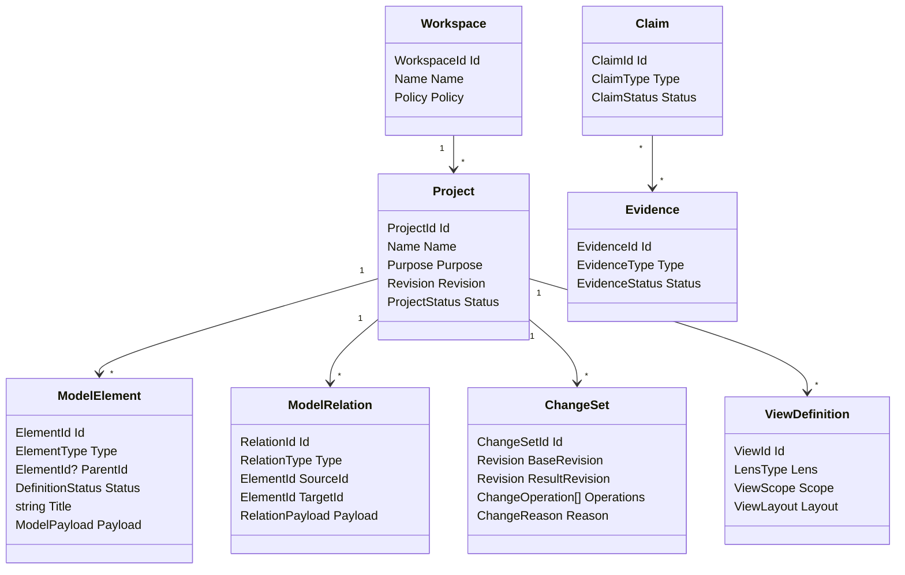

# Canonical Meta-Model

## Purpose

The canonical meta-model is the smallest durable language Project Builder uses to describe projects. It must be expressive enough to represent business behavior, human procedures, interfaces, software systems, devices, contracts, architecture, and evidence without reducing everything to generic boxes.

The model uses:

- **containment** for orientation and ownership,
- **typed relationships** for semantics,
- **typed elements** for behavior and validation,
- **projections** for views and generated artifacts,
- **change sets** for history,
- **extensions** for controlled growth.

## Aggregate overview



## Identity

All durable objects use time-ordered GUIDs created by the application. Identifiers:

- do not encode type,
- survive rename and movement,
- remain stable across projections,
- are included in exports,
- are never reused,
- are safe to reference before persistence when an offline client is introduced.

Human-readable slugs are aliases, not identity.

## Common element envelope

Every model element has:

```csharp
public abstract record ModelElement
{
    public required ElementId Id { get; init; }
    public required ProjectId ProjectId { get; init; }
    public ElementId? ParentId { get; init; }
    public required ElementKind Kind { get; init; }
    public required ElementName Name { get; init; }
    public Description Description { get; init; } = Description.Empty;
    public DefinitionStatus Status { get; init; } = DefinitionStatus.Draft;
    public ImmutableArray<Tag> Tags { get; init; } = [];
    public ImmutableArray<SourceReference> Sources { get; init; } = [];
    public required AuditStamp Created { get; init; }
    public required AuditStamp Modified { get; init; }
    public long Version { get; init; }
}
```

Concrete element records add typed fields. The domain does not expose a mutable `Dictionary<string, object>` as its primary model. Extension payloads are allowed at explicit extension points and validated against a registered schema.

## Kernel element families

### Scope and purpose

#### Project
Defines the universe of discourse, purpose, ownership, current revision, and governance profile.

#### Context
Defines a scope within which terms and rules have stable meaning.

#### Capability
Defines an ability needed to produce an outcome without prescribing workflow or implementation.

#### Outcome
Defines an observable result and beneficiary.

#### Constraint
Defines a condition imposed on the project or a contained scope, including legal, business, technical, temporal, budget, or organizational constraints.

### Participants

#### Actor
A role capable of initiating or participating in behavior.

Actor kinds:

- HumanRole.
- OrganizationRole.
- SystemRole.
- DeviceRole.
- AutomatedRole.
- ExternalProviderRole.

#### Persona
A research-backed user profile. It informs design but does not substitute for role authority.

#### System
A cohesive unit of responsibility at the current level of abstraction.

#### Device
A physical participant or interface.

### Narrative behavior

#### Episode
An end-to-end outcome-bearing span of activity.

#### Scenario
A concrete path through an episode under explicit starting conditions.

#### Scene
A contiguous segment of a scenario with stable setting, responsibility, interface, or boundary.

#### Interaction
An exchange among participants through an interface.

#### Step
An ordered explanatory unit within an interaction.

#### Intent
A desired effect expressed by an actor or system.

#### Observation
Information made available to a participant.

### State and logic

#### Concept
A named domain idea. Concept refinements include entity, value, quantity, identifier, classification, document, and policy.

#### StateDefinition
Defines a state category and its values or structure.

State categories:

- Domain.
- ApplicationWorkflow.
- Presentation.
- Infrastructure.
- ExternalObserved.

#### FactDefinition
Defines a proposition that can be present, absent, known, unknown, or time-qualified.

#### CommandDefinition
Defines a request to attempt behavior.

#### EventDefinition
Defines a relevant occurrence.

#### TransitionDefinition
Defines allowed source state, trigger, conditions, target state, produced facts, events, and effects.

#### RuleDefinition
Defines an eligibility test, decision, derivation, calculation, or policy.

#### InvariantDefinition
Defines a property required for every valid state in its scope.

#### PropertyDefinition
Defines a general claim expected to hold across examples or generated inputs.

### Paths and outcomes

#### Path
Defines a sequence or branch through a scenario.

Path classifications:

- Happy.
- Alternate.
- Exceptional.
- Degraded.
- Recovery.
- Cancellation.
- Compensation.

#### Condition
Defines a proposition that guards or branches behavior.

#### ResultDefinition
Defines semantic outcomes such as success, denial, invalidity, conflict, unavailable, partial, cancelled, timed out, and failed.

#### EffectDefinition
Defines an intended interaction with an external mechanism or participant. Effects are descriptions, not provider calls.

### Interfaces and boundaries

#### Boundary
Defines a change in ownership, trust, responsibility, transactionality, deployment, protocol, data residency, or operational control.

#### Interface
Defines a surface for intents and observations.

Interface kinds:

- Graphical.
- CLI.
- HTTP.
- RPC.
- Event.
- MCP.
- Device.
- Document.
- HumanProcedure.

#### Contract
Defines a versioned agreement at a boundary.

#### View
Defines a user-facing interface state or externally observable representation. This is part of the modeled target system, not Project Builder's own canvas view.

#### Control
Defines an affordance, command, field, endpoint, tool, signal, or step that accepts an intent.

#### Message
Defines a structured request, response, event, or document payload.

#### DataStore
Defines a logical persistent information capability. A provider-specific database instance is an infrastructure or deployment realization.

### Architecture and delivery

#### Component
Defines a responsibility-bearing implementation unit.

#### Port
Defines a required or exposed capability independent of mechanism.

#### Adapter
Defines a mechanism-specific realization of a port.

#### DeploymentUnit
Defines a separately deployed or operated unit.

#### Decision
Defines context, options, choice, rationale, evidence, consequences, and status.

#### Risk
Defines uncertainty with likelihood, impact, exposure, treatment, owner, and evidence.

#### Slice
Defines an implementation projection for a cohesive behavior.

#### Requirement
Defines a governed claim, usually imported or derived, that needs traceability.

### Validation and knowledge

#### Claim
Defines a statement requiring authority or evidence. Other elements can expose embedded claims, but first-class Claim elements are used when claims need independent ownership, status, or evidence.

#### EvidenceRequirement
Defines what kind of proof is expected and why.

#### Evidence
Defines an artifact or observation that supports or refutes one or more claims.

#### Gap
Defines a known absence, ambiguity, contradiction, unsupported claim, or deferred concern.

#### Assumption
Defines a provisional claim with owner and validation plan.

#### SourceReference
Links a model definition to a document, interview, ticket, regulation, code location, telemetry query, or external source.

## Containment

Containment is single-parent and acyclic. It answers:

- Where does this element live?
- Which scope owns its name and default policies?
- What is its narrative parent?
- Which change impact should be considered local first?

Canonical narrative containment:

```text
Project
└── Context
    └── Capability
        └── Episode
            └── Scenario
                └── Scene
                    └── Interaction
                        └── Step
```

Not every project uses every level. The model can omit a level when the meaning remains clear. For example, a small project can place episodes directly under the project. The validator reports missing context as a suggestion rather than inventing placeholder nodes.

State, rules, participants, interfaces, and evidence are generally owned by the narrowest stable context and related into scenarios. They are not duplicated under every narrative element.

## Typed relationships

Core relationship families include:

### Participation
- `initiates`
- `participates-in`
- `receives`
- `benefits-from`
- `authorizes`
- `owns`
- `supports`

### Behavior
- `realizes`
- `contains`
- `precedes`
- `follows`
- `branches-to`
- `rejoins`
- `triggers`
- `produces`
- `observes`
- `handles`
- `recovers-from`
- `compensates`

### State and rule
- `reads`
- `changes`
- `derives`
- `constrained-by`
- `preserves`
- `violates`
- `requires`
- `ensures`
- `evaluates`
- `emits`

### Interface and boundary
- `expressed-through`
- `exposes`
- `crosses`
- `governed-by-contract`
- `sends`
- `receives-message`
- `implemented-by`
- `depends-on`

### Traceability
- `defines`
- `satisfies`
- `implemented-by`
- `verified-by`
- `refutes`
- `derived-from`
- `supersedes`
- `impacts`
- `generated-from`

Each relationship type declares:

- allowed source kinds,
- allowed target kinds,
- cardinality,
- direction,
- whether cycles are allowed,
- required qualifiers,
- validation rules,
- display conventions,
- impact propagation behavior.

## Relationship qualifiers

A relationship can carry typed qualifiers such as:

- order,
- role,
- condition,
- path,
- temporal window,
- data classification,
- confidence,
- responsibility,
- contract version,
- source authority,
- cardinality.

Qualifiers must not become a second untyped element model. A qualifier that gains identity, relationships, ownership, or evidence should become an element.

## Semantic model versus view model

The canonical semantic model contains meaning. A Project Builder `ViewDefinition` contains:

- selected lens,
- root or filter scope,
- visible elements,
- positions and sizes,
- collapsed groups,
- routing hints,
- zoom and viewport,
- presentation annotations,
- shared versus personal ownership.

Moving a node changes only a view definition. Renaming the actor changes the semantic model. Hiding an actor in a lens does not remove it from a scenario.

## Unknown and optional values

Optionality is not a single `null`. Fields that materially affect understanding use a knowledge state:

```csharp
public abstract record Knowledge<T>
{
    public sealed record Known(T Value) : Knowledge<T>;
    public sealed record Unknown(UnknownReason Reason) : Knowledge<T>;
    public sealed record Assumed(T Value, AssumptionId AssumptionId) : Knowledge<T>;
    public sealed record NotApplicable(Rationale Rationale) : Knowledge<T>;
    public sealed record Deferred(GapId GapId) : Knowledge<T>;
    public sealed record Disputed(ImmutableArray<PositionId> Positions) : Knowledge<T>;
}
```

This pattern should be used selectively. Ordinary optional descriptive fields can remain nullable or optional. Material modeling questions need explicit knowledge semantics.

## Extensibility

The meta-model registry can add:

- element subtypes,
- relation types,
- inspector sections,
- guidance prompts,
- validators,
- lenses,
- projections,
- importers and exporters.

Extensions must provide:

- stable namespace and version,
- schema,
- migration policy,
- deterministic serialization,
- permissions,
- compatibility range,
- display fallback,
- security classification.

Unknown extension elements remain visible as opaque, read-only records when safe. The system must not discard them during export.
