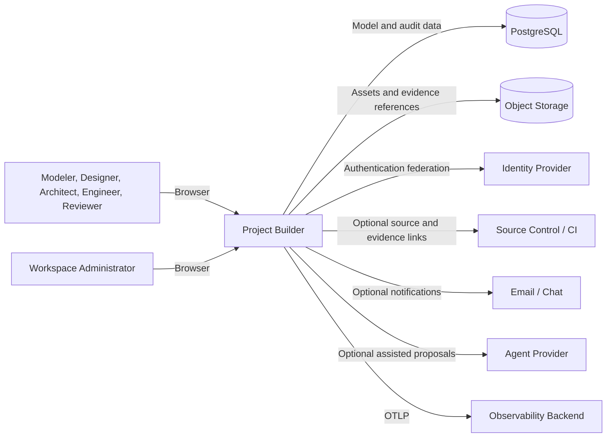
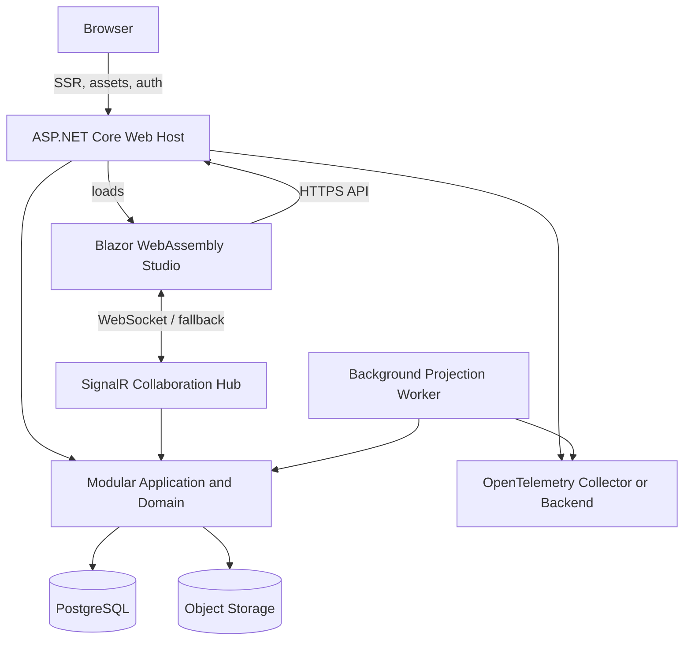
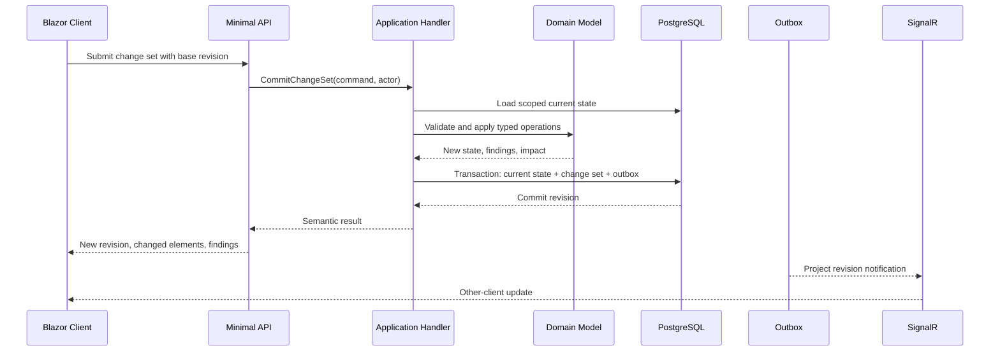

# System Context and Containers

## Architectural objective

Project Builder must preserve a canonical model, accept human-scale interactive edits, produce deterministic projections, support accountable collaboration, and remain deployable as one coherent product before distribution is necessary.

## System context



The core human workflow requires only Project Builder and its durable data stores. Source control, CI, notifications, and agent providers are optional integrations.

## Initial container model



## Containers

### Web Host

Responsibilities:

- ASP.NET Core composition root.
- Blazor Web App server-side shell and authentication pages.
- Hosted Interactive WebAssembly client assets.
- Minimal API endpoints.
- first-party OpenAPI document.
- cookie authentication and authorization.
- anti-forgery and request security.
- SignalR hub endpoints.
- health endpoints.
- module registration.
- request telemetry.

The Web Host should not contain domain rules.

### Web Client

Responsibilities:

- Studio shell.
- structured editors.
- canvas and lenses.
- local draft operation staging.
- client-side model projection where safe.
- keyboard and accessibility behavior.
- optimistic command dispatch.
- conflict and validation presentation.
- offline-capable architecture without promising offline MVP.

The client references Contracts and a client-safe Modeling Kernel, not Infrastructure.

### Application and Domain Modules

Responsibilities:

- project and workspace behavior,
- canonical model,
- commands and queries,
- validation rules,
- change-set semantics,
- revision and baseline behavior,
- guidance,
- projection definitions,
- collaboration rules,
- authorization policies at use-case boundaries.

This is the semantic core.

### Infrastructure

Responsibilities:

- EF Core and PostgreSQL,
- object storage,
- identity persistence,
- source-control and CI adapters,
- notification delivery,
- external agent adapters,
- telemetry exporters,
- time and identifier providers,
- cache and lock mechanisms if required.

### Background Worker

Responsibilities:

- large imports and exports,
- projections and generated artifacts,
- evidence synchronization,
- index updates,
- stale-evidence impact processing,
- notifications,
- retention and cleanup,
- scheduled validation.

The worker can begin as an in-process hosted service. It becomes a separately deployed process only when isolation or scaling requires it. Both use the same application contracts.

### PostgreSQL

Stores:

- workspace and identity-related application data,
- project current state,
- elements and relations,
- change sets and operations,
- views,
- claims and evidence metadata,
- comments and reviews,
- baselines,
- outbox,
- jobs,
- audit references.

### Object Storage

Stores:

- uploaded assets,
- packaged exports,
- large generated artifacts,
- optional evidence copies,
- quarantine content.

Local development can use a compatible local storage resource or file-backed adapter. Production should use an object store with retention and encryption controls.

## Module context

Initial logical modules:

```text
Identity and Workspaces
Projects and Revisions
Modeling
Guidance and Validation
Views and Canvases
Interfaces
Projections
Collaboration and Review
Evidence and Traceability
Administration and Integrations
```

Modules are code and ownership boundaries inside the monolith. They do not imply network calls.

## Interaction paths

### Write path



### Query path

```text
Client query
→ authorization and scope
→ read model query
→ PostgreSQL projection
→ cache where justified
→ contract response with revision and ETag
```

Queries do not reconstruct the project from the entire change history.

### Projection path

```text
Baseline or revision selected
→ projection request persisted
→ worker loads immutable revision/snapshot
→ generator validates prerequisites
→ deterministic artifact generated
→ content hash and provenance stored
→ user notified
```

## Consistency model

- One project change set commits atomically.
- Current project revision is strictly ordered.
- Cross-project operations are not atomic by default.
- Integration side effects use an outbox.
- Read models can be eventually updated when their delay is visible and safe.
- Authorization and model invariants are strongly enforced on writes.
- Realtime notifications announce committed state; they are not the source of truth.

## Scaling posture

Scale first through:

- efficient project-scoped queries,
- pagination,
- indexes,
- caching of immutable revisions and projections,
- background workers,
- read replicas for heavy review or search if needed,
- horizontal web-host scaling with shared SignalR backplane only when measured.

Do not split the model write path across services before transactional and consistency requirements are understood.

## Technology rationale

- .NET 10 provides the required LTS baseline.
- Blazor allows rich interactive UI in C# and shared client-safe contracts.
- Interactive WebAssembly keeps the studio responsive without making the server circuit the only interaction channel.
- PostgreSQL supports relational integrity and JSONB for typed, versioned payloads.
- EF Core 10 supports the chosen .NET baseline.
- SignalR supports collaborative application patterns.
- Aspire models local resources and dependencies in code but is not the production runtime.
- OpenTelemetry keeps observability vendor-neutral.

## Deployment independence

Application code consumes abstractions for database, object storage, notifications, identity federation, telemetry, and agent providers. Deployment can target:

- local developer containers,
- a single-node self-hosted installation,
- container platforms,
- Azure,
- AWS,
- other supported infrastructure.

The model and application architecture should not encode one cloud provider.
