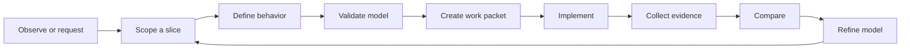

# Definition-Validated Delivery Workflow

## Delivery loop



## 1. Observe or request

Input can be:

- customer need,
- dogfood friction,
- defect,
- security finding,
- technical constraint,
- production observation,
- roadmap capability.

Create or link:

- outcome,
- affected actor,
- source reference,
- gap or proposed capability.

Do not begin with a solution title such as "Add Redis" unless the actual need is explicitly infrastructure maintenance.

## 2. Scope a vertical slice

Select the smallest behavior that:

- produces an observable result,
- preserves real domain meaning,
- can be validated end to end,
- is valuable enough to test,
- does not require a horizontal platform batch first.

Example:

Good:
> A user creates a project with a purpose and sees it on the project overview.

Too horizontal:
> Create database entities and repositories.

Too broad:
> Build project management.

## 3. Define the slice

Required model content:

- beneficiary and outcome,
- initiating actor and authority,
- trigger and starting facts,
- interactions,
- state changes,
- rules and invariants,
- semantic results,
- material alternate and failure paths,
- interface behavior,
- boundaries and contracts,
- quality constraints,
- decisions and assumptions,
- evidence plan.

## 4. Validate the model

Run:

- schema validation,
- structural validation,
- semantic validation,
- readiness profile,
- review by appropriate authority.

Resolve or explicitly accept gaps. A passing validator does not replace domain review.

## 5. Create the work packet

Packet includes:

```text
Goal
Why it matters
Scope
Non-goals
Model baseline and identifiers
Behavioral scenarios
State and invariant summary
Interface states
Boundary contracts
Fixed decisions
Open decisions
Files or modules likely affected
Evidence required
Completion command
Known risks
```

Agents receive only the necessary packet plus links into authoritative docs through progressive disclosure.

## 6. Implement

Implementation order is behavior-driven:

1. executable specification or failing acceptance evidence,
2. domain values and rule,
3. application use case,
4. ports and adapter contract,
5. persistence or external adapter,
6. presentation,
7. assembled scenario,
8. operational instrumentation,
9. documentation and model references.

The exact order can vary, but a session should not end with unobservable plumbing unless the slice is a deliberate spike.

## 7. Collect evidence

Evidence is selected before implementation and returned with:

- command,
- environment,
- result,
- output artifact,
- model claim links,
- limitations.

A passing build is necessary but not sufficient.

## 8. Compare

Review:

- actual interface behavior,
- actual state transitions,
- actual boundary behavior,
- tests and telemetry,
- implementation structure,
- model assumptions.

Ask:

- Did implementation discover missing facts?
- Did the team add behavior not in the model?
- Did a test require weakening an invariant?
- Did a provider force new semantics?
- Is the model still recognizable to stakeholders?

## 9. Refine

Update:

- model,
- decision,
- evidence status,
- guidance rules,
- implementation references,
- generated projections,
- roadmap gaps.

Do not update only the ticket or code comment.

## Session contract

Every implementation session has:

- one bounded goal,
- explicit constraints,
- expected files or scope,
- observable acceptance,
- automated evidence,
- no unrelated refactor,
- model update,
- session summary.

## Spike workflow

A spike answers a decision question, not "try things."

Spike definition:

```text
Question
Options
Decision criteria
Experiment
Time or scope bound
Evidence
Result
Recommendation
Code disposition
Model and ADR update
```

Prototype code is deleted, isolated, or promoted deliberately. It does not silently become production.

## Defect workflow

1. Capture observed behavior and source.
2. Identify expected model claim.
3. Determine divergence category:
   - model wrong,
   - implementation wrong,
   - evidence wrong,
   - environment changed,
   - assumption invalid.
4. Add failing evidence.
5. correct smallest owning definition or implementation.
6. verify related invariants and paths.
7. update stale evidence and model history.

## Refactor workflow

A refactor preserves modeled external behavior. It still needs:

- behavior baseline,
- architecture or maintainability claim,
- evidence that behavior remains,
- impact analysis,
- no accidental generated-output drift.

If behavior changes, it is not only a refactor.

## Architecture change workflow

Architecture changes require:

- scenario or quality need,
- current limitation,
- options,
- experiment or evidence,
- ADR,
- affected boundaries,
- migration and rollback,
- operational evidence,
- dogfood model update.

## Review workflow

Reviewers inspect in this order:

1. Goal and model diff.
2. Behavioral evidence.
3. Domain rules and invariants.
4. Application flow.
5. Boundary and failure behavior.
6. Security and accessibility.
7. code clarity.
8. operations and migration.
9. generated and documentation output.

This order prevents style comments from displacing correctness.

## Completion

A slice is complete when:

- model baseline or candidate is current,
- behavior is implemented,
- evidence passes,
- relevant failure paths are tested,
- implementation references are linked,
- observability exists,
- security and accessibility findings are handled,
- no blocker gaps remain,
- dogfood scenario is exercised,
- review is complete.
