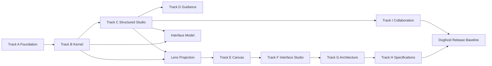

# Session-Sized Implementation Plan

## Purpose

This document breaks the initial build into bounded sessions that a human or agent-assisted worker can complete and validate independently. A session should normally fit one focused branch and one reviewable pull request. Each session ends with runnable behavior, automated evidence, and updated documentation or dogfood content.

Do not begin a later session merely because code compiles. Complete the session exit evidence first.

## Session operating contract

Each session must:

1. Read the listed context.
2. Restate the modeled outcome and invariants.
3. Inspect existing code before creating parallel abstractions.
4. Implement the smallest vertical slice.
5. Run focused tests during development.
6. Run the repository evidence command before handoff.
7. Update the dogfood model when behavior changes.
8. Produce a change summary, evidence summary, remaining risks, and exact next-session entry point.
9. Avoid unrelated cleanup.
10. Leave no hidden generator, analyzer, or environment assumptions.

## Track A: repository foundation

### Session A01: initialize repository governance

**Read:** Foundation documents, architecture repository structure, engineering standards.

**Deliver:**

- `ProjectBuilder.slnx`.
- `global.json`.
- `Directory.Build.props`.
- `Directory.Packages.props`.
- `.editorconfig`.
- root README, LICENSE decision placeholder, SECURITY, CONTRIBUTING, CODEOWNERS.
- `eng/` scripts for restore, build, test, verify, and local run.

**Proof:**

- clean restore and build.
- pinned SDK is reported.
- package versions exist only in central package file.
- formatting and analyzers run in CI mode.

### Session A02: scaffold module projects

**Deliver:** AppHost, ServiceDefaults, Web, Web.Client, Domain, Application, Infrastructure, Contracts, Projections, and initial test projects according to the repository plan.

**Proof:**

- solution builds.
- project reference graph matches documented direction.
- no placeholder project contains provider references outside Infrastructure.

### Session A03: add architecture tests

**Deliver:**

- dependency rules,
- namespace rules,
- public-surface rules,
- provider leakage checks,
- test fixtures that prove a violation is caught.

**Proof:** intentionally invalid sample or mutation test demonstrates each critical rule fails.

### Session A04: local orchestration and health

**Deliver:**

- PostgreSQL local resource.
- application configuration.
- health endpoints.
- OpenTelemetry service defaults.
- developer dashboard path.
- one-command run.

**Proof:** application and database become healthy from a clean local environment.

### Session A05: CI evidence pipeline

**Deliver:**

- restore/build/test,
- architecture,
- schema validation,
- formatting,
- dependency and secret scanning,
- build metadata,
- artifacts and summary.

**Proof:** passing and intentionally failing branch runs show useful diagnostics.

## Track B: canonical model and persistence

### Session B01: strongly typed identity and primitives

**Deliver:**

- project, workspace, element, relation, change-set, revision identifiers,
- names, descriptions, reasons, timestamps, semantic result foundation,
- parsing and serialization,
- property and example tests.

**Invariants:**

- IDs are never empty.
- names are normalized only according to explicit policy.
- domain types do not depend on JSON, EF, or ASP.NET attributes.

### Session B02: project aggregate

**Deliver:**

- Project creation behavior,
- purpose and intended outcome,
- revision 1 change set,
- semantic errors,
- application command and query,
- in-memory application test.

**Proof:** create, reject invalid, reject unauthorized, idempotent retry.

### Session B03: persistence mapping

**Deliver:**

- PostgreSQL schema,
- EF mappings,
- project and revision repositories,
- transaction boundary,
- initial migration,
- real-database tests.

**Proof:** transaction rollback and concurrency token behavior.

### Session B04: actor and outcome elements

**Deliver:** typed Actor and Outcome payloads, relations, commands, queries, validation, persistence, API, tests.

**Dogfood:** add Project Builder modeler, domain expert, facilitator, reviewer, engineer, administrator, and intended outcomes.

### Session B05: narrative elements

**Deliver:** Episode, Scenario, Scene, Interaction, Step, Intent, Observation, containment and order.

**Proof:** complete Create Project scenario plus invalid references, cycles, and missing participants.

### Session B06: state and logic elements

**Deliver:** StateDefinition, FactDefinition, RuleDefinition, InvariantDefinition, TransitionDefinition, semantic result types.

**Proof:** POS active transaction state and item-add invariant examples.

### Session B07: paths and conditions

**Deliver:** typed paths, branch conditions, results, effects, recovery links, validation.

**Proof:** POS unknown item, price-book unavailable, prohibited item, duplicate scan, and cancellation paths.

### Session B08: typed relation registry

**Deliver:**

- relation descriptors,
- allowed source/target kinds,
- direction, cardinality, uniqueness, ownership, deletion behavior,
- generated or static registry,
- exhaustive validation.

**Proof:** invalid relation combinations cannot commit.

### Session B09: change-set commit pipeline

**Deliver:**

- draft operations,
- atomic commit,
- expected revision,
- idempotency,
- reason,
- audit stamp,
- validation pipeline,
- structured conflict result.

**Proof:** stale and duplicate commits cannot overwrite or duplicate state.

### Session B10: canonical import/export

**Deliver:** schema-aligned DTOs, canonical ordering, current format reader/writer, future-version rejection, semantic validation, transactional import.

**Proof:** export-import-export byte equality and malicious fixture rejection.

## Track C: structured product experience

### Session C01: application shell and routing

**Deliver:** workspace/project routes, authenticated shell placeholder, global header, responsive regions, error boundary, theme tokens.

**Proof:** keyboard landmarks and route recovery.

### Session C02: project dashboard

**Deliver:** project purpose, outcome, revision, actors, recent changes, gaps, and next action.

**Proof:** empty, loading, unauthorized, not found, and populated states.

### Session C03: Explorer

**Deliver:** virtualized semantic tree, search filter, keyboard tree behavior, context actions, stable selection.

**Proof:** reorder and open without drag; focus survives update.

### Session C04: typed editor framework

**Deliver:** reusable field descriptors, validation display, source links, knowledge-state control, dirty tracking, command dispatch.

**Proof:** Actor editor uses framework without losing actor-specific semantics.

### Session C05: actor and outcome editors

**Deliver:** complete CRUD-style behavior through semantic commands, duplicate suggestions, relations, validation.

**Dogfood:** enter Project Builder participants and outcomes through the UI.

### Session C06: narrative editors

**Deliver:** Episode, Scenario, Scene, Interaction, and Step editors with ordering, participants, paths, and references.

**Proof:** author POS happy path through UI.

### Session C07: state and rule editors

**Deliver:** state catalog, transition table, rule editor, invariant editor, path matrix.

**Proof:** no raw JSON needed for reference POS state model.

### Session C08: Problems and evidence panels

**Deliver:** finding list, filters, repair actions, navigation, severity, owner, status, rule details.

**Proof:** intentionally incomplete model produces expected catalog and exact navigation.

### Session C09: drafts, commit preview, history

**Deliver:** local draft store, undo/redo, operation summary, reason, commit, history, revision view, diff.

**Proof:** browser refresh recovery and stale conflict handling.

### Session C10: purpose profiles and gap map

**Deliver:** profile selector, rule-set evaluation, explanation, waiver, ownership, gap visualization.

**Proof:** same model reports different Discovery and Implementation Ready requirements without changing facts.

## Track D: guidance

### Session D01: prompt registry

**Deliver:** typed prompt descriptors, applicability rules, answer mappings, rationale, learning content, repair commands, versioning.

**Proof:** registry validation detects unreachable or invalid prompts.

### Session D02: Guide Rail shell

**Deliver:** contextual drawer, progress trail, back/next, close/reopen, answer state, selection synchronization.

**Proof:** no focus theft and correct focus restoration.

### Session D03: actor and outcome guided flow

**Deliver:** prompts for participants, beneficiaries, authority, goals, constraints, and success signals.

**Proof:** novice completes project framing without mandatory jargon knowledge.

### Session D04: scenario guided flow

**Deliver:** start facts, trigger, expected outcome, scenes, interactions, state, paths, failures, recovery, evidence.

**Proof:** POS item-scan flow created from blank project.

### Session D05: completeness recommendations

**Deliver:** deterministic next-action selection based on purpose, findings, dependencies, and recent work.

**Proof:** recommendation rationale is explainable and stable.

### Session D06: workshop mode

**Deliver:** facilitator controls, parking lot, decision/assumption/question capture, participant view, exportable workshop summary.

**Proof:** complete internal Project Builder discovery workshop.

## Track E: lenses and canvas

### Session E01: lens projection contract

**Deliver:** immutable lens graph, scope, filters, diagnostics, node/edge ports, inspector schema, deterministic projection tests.

### Session E02: Story Map lens

**Deliver:** outcomes, capabilities, episodes, scenarios, scenes, actors, priority and status overlays.

### Session E03: Scenario Flow lens

**Deliver:** interactions, conditions, paths, results, boundary crossings, path playback.

### Session E04: State and Rule lens

**Deliver:** states, transitions, rules, invariants, events, effects; matrix and graph forms.

### Session E05: System Context lens

**Deliver:** actors, systems, interfaces, boundaries, contracts, ownership and trust overlays.

### Session E06: Traceability lens

**Deliver:** outcome-to-evidence paths, missing-link highlighting, impact query.

### Session E07: canvas interaction kernel

**Deliver:** SVG viewport, selection, pan, zoom, keyboard movement, connectors, frames, alignment, command mapping, semantic outline.

**Proof:** all pointer operations have keyboard or menu equivalents.

### Session E08: layout persistence

**Deliver:** personal/team view definitions, deterministic auto-layout input, no semantic revision, reset.

### Session E09: drilldown and navigation

**Deliver:** open scope, breadcrumbs, cross-scope stubs, back/forward, deep links.

### Session E10: scenario overlay

**Deliver:** play, pause, step, branch selection, state/observation panels, invariant stop.

## Track F: interface modeling

### Session F01: common interface model

**Deliver:** interface envelope, accepted intents, observations, state, errors, authorization, contract, constraints.

### Session F02: graphical interface model and renderer

**Deliver:** frames, regions, controls, bindings, focus order, responsive rules, component instances.

### Session F03: graphical editor interactions

**Deliver:** insert, resize, align, group, bind, inspect, keyboard operations, reusable component definition.

### Session F04: non-graphical interface editors

**Deliver:** CLI, HTTP/RPC, Event, MCP, Device, Document, and Human Procedure structured editors.

### Session F05: scenario-on-interface mapping

**Deliver:** step binding, initial state, transition, result, next state, alternate branch, playback.

### Session F06: interface validation

**Deliver:** missing state, unbound intent, inaccessible control, unrepresented result, impossible transition, contract mismatch findings.

### Session F07: POS interface walkthrough

**Deliver:** scanner input, transaction grid, totals, status, prompts, unknown item, offline, prohibited item, duplicate scan, retry and override.

## Track G: boundaries and implementation projection

### Session G01: boundary taxonomy and editor

### Session G02: system and component decomposition

### Session G03: contracts and operational properties

### Session G04: inner-context decomposition

### Session G05: Presentation/Application/Domain/Infrastructure projection

### Session G06: threat, privacy, and reliability overlays

### Session G07: implementation-ready profile

For each G session, deliver domain semantics, UI, persistence, validation, tests, and dogfood entries. The track exits only when the POS item scan projects into a complete vertical slice with no unexplained boundary crossing.

## Track H: specifications and evidence

### Session H01: projection execution framework

### Session H02: behavioral specification generator

### Session H03: state and decision table generator

### Session H04: contract projection generators

### Session H05: test and property candidate generator

### Session H06: evidence records and artifact storage

### Session H07: claim coverage and staleness analysis

### Session H08: baselines, approvals, and release packets

### Session H09: model-to-test binding

### Session H10: first dogfood-generated release packet

## Track I: collaboration and administration

### Session I01: authentication and workspace membership

### Session I02: role and policy enforcement

### Session I03: comments and review requests

### Session I04: presence and notifications

### Session I05: conflict-resolution experience

### Session I06: audit search

### Session I07: attachments and source evidence

### Session I08: backup, restore, retention, export, and deletion

### Session I09: scale and resilience verification

## Session dependency graph



## Parallel-work guidance

Safe early parallelism:

- A03 architecture tests can proceed beside A04 local orchestration after A02.
- B04 actor/outcome and B05 narrative design can be prepared in separate branches but should merge in order if they share the element registry.
- UI shell work can begin against contracts after B02, but semantic editors wait for stable commands.
- schema and fixture work can proceed with domain type work using a reviewed contract.
- accessibility harness and telemetry harness can start early.

High-conflict zones:

- canonical element envelope,
- change-set operation union,
- relation registry,
- serialization options,
- application command pipeline,
- root Studio layout,
- lens graph types,
- source-generator project wiring.

Assign one owner at a time or stack branches explicitly through these zones.

## Handoff template

At the end of every session, add this to the PR:

```markdown
## Modeled outcome
...

## Behavior delivered
...

## Canonical model changes
...

## Invariants preserved
...

## Evidence
- command:
- tests:
- artifacts:
- manual scenario:

## Decisions and assumptions
...

## Known gaps
...

## Exact next entry point
...
```
