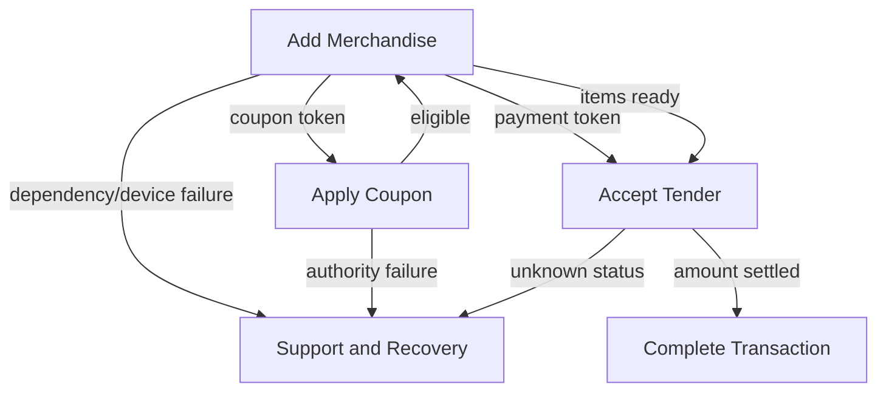

# POS Episode and Scenario Catalog

## Purpose

This catalog provides breadth around the deep item-scan slice. It helps test hierarchy, reuse, path classification, cross-episode interactions, completeness, search, and traceability. Each scenario still requires detailed modeling before implementation.

## POS-EP-001: establish checkout session

**Outcome:** Authorized clerk operates the correct register and store context.

Scenarios:

| Alias | Scenario | Classification |
|---|---|---|
| POS-SCN-001 | Clerk signs into available register | Happy |
| POS-SCN-002 | Clerk credentials are invalid | Exceptional |
| POS-SCN-003 | Clerk lacks checkout permission | Denied |
| POS-SCN-004 | Register is assigned to another active session | Conflict |
| POS-SCN-005 | Identity provider is unavailable but approved continuity mode exists | Degraded |
| POS-SCN-006 | Clerk ends session with open transaction | Alternate/Exceptional |

Material invariants:

- every transaction action is attributed to an authorized operating context,
- store and register context cannot silently change during an active transaction.

## POS-EP-005: start transaction

**Outcome:** A new active transaction exists for checkout.

| Alias | Scenario | Classification |
|---|---|---|
| POS-SCN-0050 | Clerk starts ordinary sale | Happy |
| POS-SCN-0051 | Existing suspended transaction is resumed | Alternate |
| POS-SCN-0052 | Register already has active transaction | Conflict |
| POS-SCN-0053 | Customer context is attached | Alternate |
| POS-SCN-0054 | Transaction start is cancelled | Cancellation |

## POS-EP-010: add merchandise

**Outcome:** Intended merchandise is represented accurately or the clerk receives an actionable result.

| Alias | Scenario | Classification |
|---|---|---|
| POS-SCN-010 | Known sellable product is scanned | Happy |
| POS-SCN-011 | Same product is intentionally scanned twice | Alternate |
| POS-SCN-012 | Scanner delivery is duplicated for one attempt | Exceptional |
| POS-SCN-013 | Token is unreadable or malformed | Exceptional |
| POS-SCN-014 | Token is classified as a payment token | Alternate route |
| POS-SCN-015 | Token is classified as a coupon | Alternate route |
| POS-SCN-016 | Product code is unknown | Exceptional |
| POS-SCN-017 | Product is inactive | Exceptional |
| POS-SCN-018 | Product has no applicable store price | Exceptional |
| POS-SCN-019 | Product is prohibited | Denied |
| POS-SCN-020 | Product requires manager override | Alternate |
| POS-SCN-021 | Product requires customer age verification | Alternate |
| POS-SCN-022 | Corporate price authority times out | Degraded |
| POS-SCN-023 | Verified local price snapshot is used | Degraded |
| POS-SCN-024 | Transaction changes before item commit | Conflict |
| POS-SCN-025 | Clerk cancels pending item lookup | Cancellation |
| POS-SCN-026 | Late lookup result arrives after cancellation | Exceptional |
| POS-SCN-027 | Manual item search succeeds | Alternate |
| POS-SCN-028 | Weighted item is scanned | Alternate |
| POS-SCN-029 | Item price changes during active transaction | Disputed policy |
| POS-SCN-030 | Scanner is disconnected | Degraded |

## POS-EP-020: change merchandise

**Outcome:** Quantity and line composition reflect authorized intent.

| Alias | Scenario | Classification |
|---|---|---|
| POS-SCN-100 | Clerk changes quantity | Happy |
| POS-SCN-101 | Clerk removes line | Happy |
| POS-SCN-102 | Removal requires manager approval | Alternate |
| POS-SCN-103 | Quantity violates product constraint | Denied |
| POS-SCN-104 | Transaction changes concurrently | Conflict |
| POS-SCN-105 | Clerk cancels line edit | Cancellation |
| POS-SCN-106 | Weighted item quantity is corrected | Alternate |

## POS-EP-030: apply manufacturer coupon

**Outcome:** Eligible manufacturer discount is represented once and is auditable.

| Alias | Scenario | Classification |
|---|---|---|
| POS-SCN-200 | Valid coupon applies to eligible item | Happy |
| POS-SCN-201 | Coupon token is unrecognized | Exceptional |
| POS-SCN-202 | Coupon is expired | Denied |
| POS-SCN-203 | Required product is absent | Denied |
| POS-SCN-204 | Purchase quantity is insufficient | Denied |
| POS-SCN-205 | Coupon was already applied | Duplicate/Denied |
| POS-SCN-206 | Coupon authority is unavailable | Degraded |
| POS-SCN-207 | Coupon requires manual review | Alternate |
| POS-SCN-208 | Coupon is removed after product removal | Recovery |
| POS-SCN-209 | Clearing rejects coupon after local acceptance | Compensation/Exception |

## POS-EP-031: apply corporate coupon

**Outcome:** Corporate promotion or coupon changes the transaction according to current policy.

| Alias | Scenario | Classification |
|---|---|---|
| POS-SCN-220 | Valid corporate coupon applies | Happy |
| POS-SCN-221 | Coupon targets customer segment | Alternate |
| POS-SCN-222 | Coupon conflicts with another promotion | Alternate/Denied |
| POS-SCN-223 | Coupon has usage limit | Denied |
| POS-SCN-224 | Coupon policy version changes during transaction | Conflict |
| POS-SCN-225 | Local cached policy is stale | Degraded |

## POS-EP-040: accept cash payment

**Outcome:** Accepted cash settles the required amount and change is represented.

| Alias | Scenario | Classification |
|---|---|---|
| POS-SCN-300 | Exact cash is accepted | Happy |
| POS-SCN-301 | Cash requires change | Happy |
| POS-SCN-302 | Tender is less than amount due | Alternate |
| POS-SCN-303 | Drawer cannot open | Degraded |
| POS-SCN-304 | Clerk enters wrong amount and corrects before commit | Recovery |
| POS-SCN-305 | Cash tender is cancelled | Cancellation |
| POS-SCN-306 | Cash limit or policy is exceeded | Denied |

Invariants:

- change cannot be negative,
- transaction is paid only when accepted tender equals the amount due under rounding policy,
- drawer and ledger behavior are attributable.

## POS-EP-041: accept card payment

**Outcome:** A customer-authorized electronic payment settles the intended amount exactly once.

| Alias | Scenario | Classification |
|---|---|---|
| POS-SCN-320 | Card is authorized and captured | Happy |
| POS-SCN-321 | Card is declined | Denied |
| POS-SCN-322 | Customer cancels at terminal | Cancellation |
| POS-SCN-323 | Provider times out before final status | Exceptional |
| POS-SCN-324 | Retry returns prior authorization | Recovery |
| POS-SCN-325 | Duplicate request is received | Duplicate |
| POS-SCN-326 | Partial authorization is offered | Alternate |
| POS-SCN-327 | Terminal is unavailable | Degraded |
| POS-SCN-328 | Authorization succeeds but local commit fails | Compensation/Recovery |
| POS-SCN-329 | Local commit succeeds but response is interrupted | Recovery |
| POS-SCN-330 | Card is removed too early | Alternate/Exceptional |

## POS-EP-042: accept QR payment

**Outcome:** A QR-mediated payment settles the intended amount exactly once.

| Alias | Scenario | Classification |
|---|---|---|
| POS-SCN-340 | Register displays code and provider confirms | Happy |
| POS-SCN-341 | Code expires | Exceptional |
| POS-SCN-342 | Customer pays wrong or stale transaction | Conflict |
| POS-SCN-343 | Provider callback is duplicated | Duplicate |
| POS-SCN-344 | Callback arrives after clerk cancels | Exceptional/Recovery |
| POS-SCN-345 | Status polling and callback disagree | Disputed external state |
| POS-SCN-346 | Provider is unavailable | Degraded |

## POS-EP-045: mixed tender

**Outcome:** Several accepted tenders settle one transaction without overpayment or duplicate effect.

Scenarios:

- cash plus card,
- gift instrument plus card,
- partial authorization then alternate tender,
- one tender reversed,
- final tender fails,
- cancellation after partial settlement,
- refund or compensation required.

This episode requires an explicit payment aggregate or saga decision and is outside the first item-scan implementation slice.

## POS-EP-050: complete transaction

**Outcome:** The transaction reaches a completed state and required observations/effects are initiated.

Scenarios:

- physical receipt printed,
- electronic receipt delivered,
- printer unavailable,
- downstream event delayed,
- customer declines receipt,
- payment final but receipt fails,
- post-completion correction requested.

## POS-EP-060: suspend and resume

Scenarios:

- clerk suspends active unpaid transaction,
- another register resumes it,
- resume conflicts with current owner,
- suspended transaction expires,
- required state is unavailable,
- transaction is cancelled.

## POS-EP-070: void or correct transaction

Scenarios:

- pre-payment line void,
- post-payment void,
- same-day correction,
- provider reversal fails,
- manager approval,
- audit review.

## Cross-episode routes

A route does not duplicate the target episode. It creates a typed relation and preserves traceability.

## Scenario quality requirements

An implementation-ready scenario must include:

- source context and version,
- actors and authority,
- starting facts,
- trigger,
- ordered scenes and interactions,
- semantic results,
- state transitions,
- invariants,
- interface observations,
- boundaries and properties,
- idempotency/concurrency where material,
- example data,
- evidence claims.

Catalog entries that lack these remain Discovery-level outlines.
