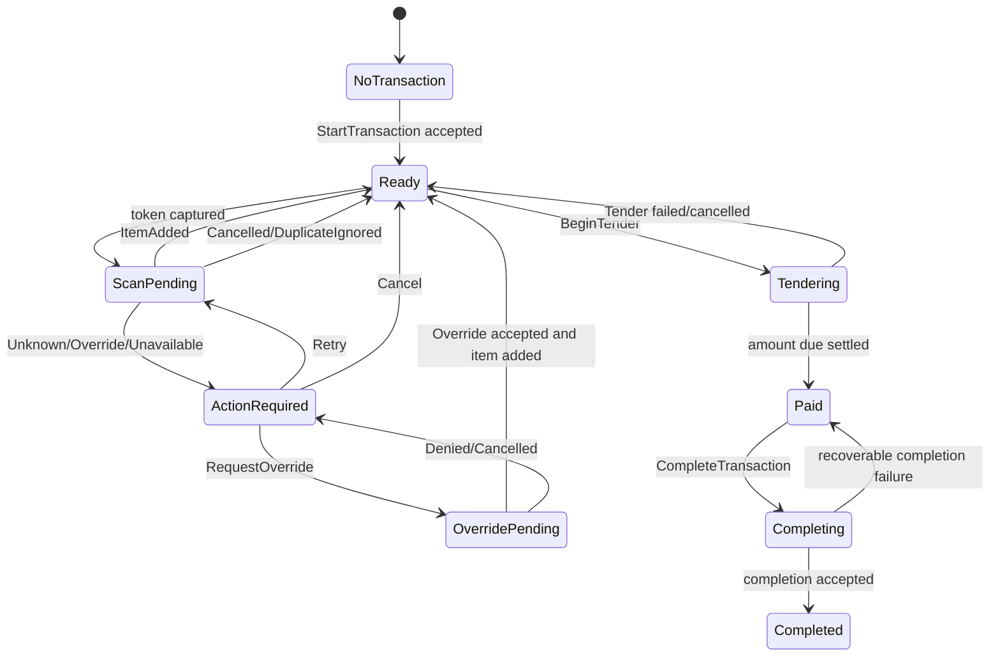

# POS Interface and State Model

## Purpose

The POS interface must represent transactional truth, application workflow, device observations, and user action without blending those categories. This document provides a reference interface model that can be rendered graphically and inspected as structured data.

## Interface catalog

### POS-IF-001: clerk transaction interface

**Kind:** Graphical  
**Actors:** Clerk, Manager  
**Accepted intents:**

- StartTransaction.
- SubmitScannedToken.
- SearchProduct.
- AddSelectedProduct.
- ChangeQuantity.
- RemoveLine.
- ApplyCoupon.
- BeginTender.
- RequestOverride.
- RetryPendingOperation.
- CancelPendingOperation.
- CompleteTransaction.
- RequestHelp.

**Observations:**

- operating context,
- transaction state,
- current amount due,
- pending operation,
- semantic result,
- allowed next actions,
- dependency/device status,
- audit/support reference.

### POS-IF-002: scanner signal interface

**Kind:** Device  
**Accepted observation:** token frame with device and delivery identity.  
**Output to device:** optional acknowledgement, readiness, error indicator.  
**Properties:** association, debounce, duplication, order, disconnect, limits.

### POS-IF-003: checkout application API

**Kind:** HTTP/RPC or in-process application contract  
**Operations:** use-case-specific intents and observations.  
**Properties:** authentication, expected revision, idempotency, problem/result schema, limits.

### POS-IF-004: price authority contract

**Kind:** HTTP/Event/Replicated Read Model, decision pending.

### POS-IF-005: payment terminal interface

**Kind:** Device/RPC  
**Properties:** customer display, consent, amount, cancellation, status, privacy, certification boundary.

### POS-IF-006: support interface

**Kind:** Graphical/CLI/HumanProcedure  
**Purpose:** safe diagnostics and recovery without direct financial mutation.

## Graphical frame hierarchy

```text
CheckoutShell
├── OperatingContextHeader
│   ├── Store
│   ├── Register
│   ├── Clerk
│   ├── SessionStatus
│   └── ConnectivitySummary
├── TransactionRegion
│   ├── TransactionLineGrid
│   ├── SelectedLineDetail
│   └── EmptyTransactionState
├── SummaryRegion
│   ├── Subtotal
│   ├── Discounts
│   ├── Tax
│   ├── Fees
│   ├── Paid
│   └── AmountDue
├── WorkflowStatusRegion
│   ├── CurrentAction
│   ├── SemanticResult
│   ├── Progress
│   └── SupportReference
├── PrimaryActions
└── ContextualPanel
    ├── Search
    ├── Override
    ├── Coupon
    ├── Tender
    └── Help
```

Frames are interface composition. They are not domain aggregates.

## Read-model bindings

| Interface field | Read source | Domain truth? | Notes |
|---|---|---:|---|
| transaction lines | TransactionObservation | yes, projected |
| amount due | TransactionObservation | yes, derived |
| selected line | local view state | no | UI only |
| pending scan | ScanWorkflowObservation | no, application workflow |
| price-book offline | DependencyObservation | no, infrastructure observation |
| override reason | SemanticResult/PolicyObservation | yes/derived |
| active clerk | OperatingContextObservation | relevant domain/application fact |
| open help panel | local view state | no |
| status announcement | result presentation | no, represents truth |

## Interface state machine



This state machine describes interface/workflow state. The domain transaction has its own status and transitions.

## Semantic result presentation matrix

| Result | Status tone | Persistent? | Focus behavior | Allowed next actions |
|---|---|---:|---|---|
| ItemAdded | confirmation | brief | retain scan context | scan, edit, tender |
| UnknownProduct | actionable warning | until action | move only when manual action required | retry, search, cancel, help |
| OverrideRequired | restriction | until resolved | focus first permitted override action | request override, cancel |
| SaleProhibited | denial | until acknowledged | stay in context | acknowledge, remove input |
| DependencyUnavailable | degraded | until recovery | no modal trap | retry, approved fallback, cancel |
| Conflict | stale-state warning | until refresh | focus refresh action | refresh/retry, cancel |
| DuplicateIgnored | informational | brief | no change | continue |
| InvalidSignal | device guidance | until next input | no disruptive focus | rescan, inspect device |
| PaymentUnknown | critical pending | persistent | prevent duplicate payment action | resolve status, support |
| Completed | confirmation | until next transaction | focus start/new action | receipt, new transaction |

Tone is semantic and accessible. It is not defined only by color.

## Command availability

The interface derives available actions from:

- transaction status,
- application workflow state,
- actor authority,
- selected line or context,
- dependency policy,
- semantic result,
- local view state only where it affects presentation.

A disabled control must have an explainable reason. Hidden controls are used when disclosure itself is inappropriate, not merely to avoid explanation.

## Focus contract

- scanner capture does not steal browser focus,
- ordinary successful scans do not move focus,
- modal behavior is reserved for truly blocking decisions,
- opening a contextual panel moves focus to its heading or first meaningful control,
- closing restores focus to the invoking control or operational scan context,
- status changes use suitable live regions,
- error summary links to the affected control,
- keyboard order follows visual and semantic order,
- no global shortcut overrides text-entry behavior unexpectedly.

## Responsive behavior

The primary operating target may be a fixed register display, but the model describes:

- minimum supported viewport,
- zoom to 200 percent,
- high contrast,
- enlarged text,
- touch target size where touch is supported,
- alternate layout for support/tablet views,
- transaction grid overflow,
- summary persistence,
- no loss of semantic result.

Responsive layout changes are view behavior and do not change the scenario.

## Input binding

### Scanner

`ScannerTokenCaptured` maps to `SubmitScannedToken` through the device adapter. The UI can show immediate pending feedback but cannot optimistically add a line.

### Manual search

Search query is presentation/application input. Selecting a product produces `AddSelectedProduct` with product identity and expected transaction version.

### Quantity

Quantity edit produces a typed intent with parsing, bounds, authority, and result. The numeric field does not directly bind two-way to the domain entity.

### Override

The Request Override action starts a separate interaction involving authority, reason, and possibly another credential or device.

## Accessibility evidence targets

- keyboard-only start, scan simulation, recovery, item edit, tender initiation, and completion,
- screen-reader announcement for result changes,
- no drag-only line reordering or interface modeling operation,
- visible focus,
- high-contrast status distinction,
- error instructions linked to controls,
- reduced animation,
- meaningful table semantics or accessible alternative,
- timeout warning and extension where applicable.

## Device simulator

For Project Builder playback and target-system testing, define a scanner simulator:

```text
Input:
- DeviceId
- AttemptId
- Token
- DeliveryCount
- InterDeliveryDelay
- DisconnectAt?
- MalformedFrame?

Actions:
- Send
- Duplicate
- Delay
- Disconnect
- Reconnect
- Cancel
```

This supports deterministic scenario evidence without requiring physical hardware in every test layer.

## Interface review packet

For each scenario, generate:

- starting visible state,
- action sequence,
- semantic result matrix,
- state transition,
- focus/announcement behavior,
- screenshots or structured frames,
- unresolved accessibility findings,
- linked domain and boundary claims,
- evidence plan.
