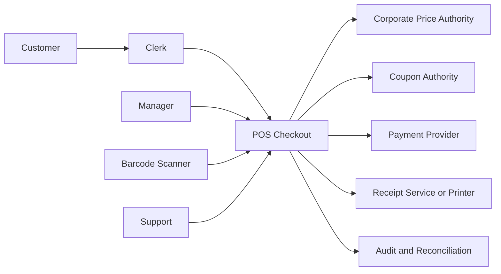

# POS Boundaries, Contracts, and Evidence

## System context



Every arrow represents one or more typed interactions, not an assumed bidirectional integration.

## Boundary catalog

### POS-BND-001: human-to-register interaction

Types:

- trust,
- authorization,
- accessibility,
- human handoff.

Properties:

- authenticated operating context,
- role and override policy,
- understandable result,
- keyboard and assistive path,
- inactivity and session behavior.

### POS-BND-002: scanner device boundary

Types:

- physical device,
- protocol,
- failure domain.

Properties:

- association,
- frame format,
- delivery identity,
- duplication,
- debounce,
- ordering,
- maximum token size,
- disconnect/reconnect,
- diagnostics.

### POS-BND-010: corporate price authority

Types:

- ownership,
- process/deployment,
- protocol,
- availability,
- data freshness.

Properties to decide:

- online API, event distribution, local replication, or hybrid,
- product/store/time keys,
- version and effective period,
- consistency and staleness,
- timeout and retry,
- fallback,
- authorization,
- data classification,
- recovery and reconciliation.

### POS-BND-020: coupon authority

Types:

- provider,
- financial settlement,
- protocol,
- delayed outcome.

Properties:

- validation versus clearing,
- idempotency,
- policy version,
- duplicate coupon identity,
- outage behavior,
- later rejection,
- audit and settlement.

### POS-BND-030: payment provider

Types:

- high-trust financial,
- vendor,
- device/process,
- asynchronous result,
- compliance boundary.

Properties:

- sensitive-data scope,
- request identity,
- authorization/capture semantics,
- cancellation,
- status query,
- callback authentication,
- duplicate/out-of-order events,
- timeout and unknown status,
- reversal,
- reconciliation,
- certificate/key management.

### POS-BND-040: transaction persistence

Types:

- transaction,
- process,
- recovery.

Properties:

- atomic line and total update,
- expected version,
- idempotency,
- audit,
- backup,
- replication,
- availability and latency.

### POS-BND-050: receipt

Types:

- device/provider,
- post-settlement effect.

Properties:

- physical/electronic,
- retry,
- customer preference,
- failure after payment,
- content privacy,
- duplicate receipt,
- evidence.

## Contract templates

### Product-price resolution contract

```json
{
  "request": {
    "storeId": "104",
    "productCode": "012345678905",
    "businessInstant": "2026-08-15T15:00:00Z",
    "context": {
      "channel": "StoreRegister"
    }
  },
  "result": {
    "kind": "Resolved",
    "productId": "P-100",
    "description": "Example Product",
    "sellability": "Allowed",
    "unitPrice": {
      "currency": "USD",
      "amount": "3.49"
    },
    "provenance": {
      "authorityVersion": "PB-2026-08-15-17",
      "effectiveFrom": "2026-08-15T00:00:00Z"
    }
  }
}
```

This illustrates owned semantics. The real transport schema needs versioning, limits, errors, authentication, and compatibility rules.

### Scanner signal contract

```json
{
  "deviceId": "SCN-7-A",
  "registerId": "7",
  "deliveryId": "018f-example",
  "capturedAt": "2026-08-15T15:00:00Z",
  "token": "012345678905"
}
```

The application assigns or maps an `AttemptId` according to the device protocol.

### Transaction intent contract

```json
{
  "attemptId": "018f-attempt",
  "transactionId": "T-9001",
  "expectedRevision": 12,
  "operatingContextId": "OC-104-7",
  "source": {
    "kind": "Scanner",
    "deviceId": "SCN-7-A"
  },
  "token": "012345678905"
}
```

### Semantic result envelope

```json
{
  "attemptId": "018f-attempt",
  "result": {
    "kind": "ItemAdded",
    "transactionRevision": 13,
    "line": {
      "productId": "P-100",
      "quantity": "1",
      "unitPrice": {
        "currency": "USD",
        "amount": "3.49"
      }
    }
  },
  "observationVersion": 13
}
```

Expected results should not be flattened into generic exceptions.

## Vertical responsibility map

| Concern | Presentation | Application | Domain | Infrastructure |
|---|---|---|---|---|
| scanner bytes | receive/map | coordinate | normalized token concepts | protocol driver |
| token class | display route | invoke | classification rule | none unless policy data external |
| product lookup | pending/result | call port | product/price concepts | price adapter/local projection |
| eligibility | show reason | supply context | policy decision | policy source adapter if external |
| add line | render state | load/commit/map | transition/invariants | repository |
| duplicate | show prior result | idempotency | attempt invariant where owned | unique storage/inbox |
| audit | display reference | emit owned audit fact | relevant domain event | durable sink |
| telemetry | status only | trace use case | no framework dependency | exporters |

## Evidence catalog

### POS-CLM-001: valid product produces one correctly priced line

Evidence set:

- POS-EV-001A domain example,
- POS-EV-001B application integration,
- POS-EV-001C price contract,
- POS-EV-001D PostgreSQL transaction test,
- POS-EV-001E browser/device scenario.

### POS-CLM-002: duplicate delivery cannot double add

Evidence set:

- property over repeated application of same AttemptId,
- database uniqueness/idempotency integration,
- device simulator duplicate E2E,
- trace review showing one commit.

### POS-CLM-003: failed attempt leaves transaction unchanged

Evidence set:

- property for all non-success domain results,
- application tests for provider errors,
- transaction rollback integration,
- scenario playback.

### POS-CLM-004: stale transaction cannot be overwritten

Evidence set:

- PostgreSQL concurrency test,
- API `If-Match` or expected-revision contract test,
- UI conflict recovery E2E.

### POS-CLM-005: every semantic result has a clerk-facing representation

Evidence set:

- exhaustive result presenter compile/analyzer check,
- component parameterized tests,
- interface result matrix validation,
- accessibility review.

### POS-CLM-006: price decision is explainable

Evidence set:

- provider/replication contract,
- persistence provenance test,
- audit projection snapshot,
- operator support walkthrough.

### POS-CLM-007: provider outage follows approved degradation policy

Evidence set:

- architecture decision,
- adapter failure injection,
- application scenario tests,
- E2E degraded UI,
- operational runbook exercise.

## Evidence manifest shape

```json
{
  "evidenceId": "POS-EV-001D",
  "claimIds": ["POS-CLM-001", "POS-INV-003"],
  "modelRevision": 42,
  "codeRevision": "git:example",
  "kind": "IntegrationTest",
  "environment": "ephemeral-postgresql",
  "producer": "ci",
  "tool": "dotnet test",
  "status": "Passed",
  "artifactDigest": "sha256:...",
  "completedAt": "2026-08-15T15:30:00Z",
  "limitations": []
}
```

## Architecture decision candidates

### POS-ADR-001: product-price data access

Options:

- synchronous corporate lookup,
- store-local replicated read model,
- hybrid local-first with online verification.

Decision drivers:

- checkout latency,
- corporate availability,
- store continuity,
- price freshness,
- operational complexity,
- reconciliation,
- data volume and update frequency.

### POS-ADR-002: item-scan idempotency identity

Options:

- scanner delivery ID,
- POS-created attempt before processing,
- composite session/device/sequence,
- transport-specific inbox plus application attempt.

Decision drivers:

- device capability,
- reconnect behavior,
- intentional repeated scans,
- offline operation,
- retention.

### POS-ADR-003: transaction consistency boundary

Options:

- transaction aggregate in one relational transaction,
- distributed components with saga,
- event-sourced transaction.

Initial reference direction is one transactional aggregate unless evidence requires distribution.

### POS-ADR-004: payment state recovery

Options:

- status query,
- idempotent replay,
- asynchronous callback,
- all of the above with reconciliation.

This decision is separate from item scan.

## Threat prompts

- Can a device impersonate another register?
- Can a token exceed limits or inject active content?
- Can a clerk submit against another store or transaction?
- Can an external response alter price without provenance?
- Can a callback be replayed?
- Can logs expose sensitive token or payment data?
- Can support access mutate financial state?
- Can a stale register overwrite a current transaction?
- Can an imported model contain malicious markup?

## Operational prompts

- What happens when corporate connectivity fails?
- How long can local data be trusted?
- How are failed outbox messages recovered?
- How is a stuck unknown payment surfaced?
- Can a store complete current transactions during deployment?
- What telemetry indicates clerk impact rather than only server health?
- How is a transaction restored or reconstructed?
- Which provider keys or certificates expire?
- What is the store escalation path?

## Implementation-ready exit for item scan

The slice is implementation ready when:

- product/price authority strategy is decided,
- all semantic results are exhaustive,
- store/time/policy context is precise,
- transaction invariants and rounding policy are sourced,
- idempotency identity is decided,
- concurrency contract is defined,
- interface states and keyboard behavior are modeled,
- boundary security and limits are specified,
- evidence plan covers domain, adapter, persistence, API/UI, accessibility, and operations,
- every remaining assumption is non-blocking or assigned to a bounded spike.
