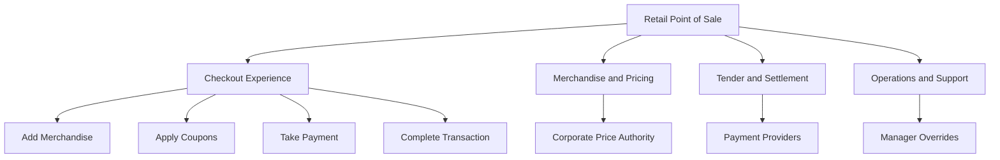

# Worked Example: Retail Point of Sale

## Purpose

This example is a reference model for Project Builder development, onboarding, automated fixtures, usability studies, projection tests, and dogfooding. It demonstrates how one domain can unfold from human intent through interface, domain logic, external boundaries, implementation slices, and evidence.

It is not a normative retail specification. Pricing, coupons, tax, payments, age restrictions, receipts, and financial controls vary by retailer, provider, and jurisdiction. Statements without an attached authority remain assumptions.

## Reference scope

The example centers on a store-operated point of sale that supports:

- starting and maintaining a transaction,
- scanning and manually entering merchandise,
- classifying scanned tokens,
- product and store-price resolution,
- manufacturer and corporate coupons,
- cash, card, and QR payments,
- restrictions and manager overrides,
- selected offline and degraded behavior,
- receipt and audit outcomes.

The complete retail platform is intentionally outside the reference scope.

## Model map

| Document | Purpose |
|---|---|
| [Project and actors](01-project-and-actors.md) | purpose, outcomes, participants, authority, constraints |
| [Episode and scenario catalog](02-episode-scenario-catalog.md) | behavioral breadth and path inventory |
| [Item-scan vertical slice](03-item-scan-vertical-slice.md) | deep end-to-end reference slice |
| [Payment and coupon paths](04-payment-and-coupon-paths.md) | examples with external providers and financial state |
| [Interface and state model](05-interface-and-state-model.md) | visible state, intents, controls, results, transitions |
| [Boundaries, contracts, and evidence](06-boundaries-contracts-and-evidence.md) | architecture and validation projection |
| [Machine-readable fixture](../schemas/pos-example.project-builder.json) | compact schema-valid example |

## Modeling aliases

The human-readable aliases below supplement durable GUID identity.

| Alias prefix | Kind |
|---|---|
| POS-OUT | Outcome |
| POS-ACT | Actor |
| POS-CAP | Capability |
| POS-EP | Episode |
| POS-SCN | Scenario |
| POS-SCE | Scene |
| POS-INT | Interaction |
| POS-STATE | State |
| POS-RULE | Rule |
| POS-INV | Invariant |
| POS-BND | Boundary |
| POS-IF | Interface |
| POS-CON | Contract |
| POS-CLM | Claim |
| POS-EV | Evidence |

Aliases can change. Durable identity does not.

## Primary reference chain

```text
POS-OUT-001 Accurate item representation
  -> POS-CAP-010 Merchandise entry
  -> POS-EP-010 Add merchandise to transaction
  -> POS-SCN-010 Known product scanned
  -> POS-SCE-011 Capture token
  -> POS-SCE-012 Classify token
  -> POS-SCE-013 Resolve product and price
  -> POS-SCE-014 Add transaction line
  -> POS-SCE-015 Present result
  -> POS-INV-001 Transaction total
  -> POS-BND-010 Corporate price authority
  -> POS-CLM-001 Valid product produces one correctly priced line
  -> POS-EV-001 Domain/application/E2E evidence set
```

## Context hierarchy



## How the repository should use this example

### Domain tests

Use small slices of the fixture as named examples and property-generator seeds.

### Contract tests

Validate import/export, format migration, identifier resolution, typed relations, and deterministic ordering.

### UI tests

Use representative scenarios for structured editors, Problems, guidance, lenses, canvas, interface playback, history, and baselines.

### Performance tests

Generate larger deterministic models from the same ontology rather than copying arbitrary nodes.

### Documentation

All screenshots and tutorials should identify the fixture revision they represent.

### Product validation

When Project Builder cannot represent a legitimate POS distinction without a prose escape hatch, create a model finding and evaluate whether the kernel or an extension should evolve.
